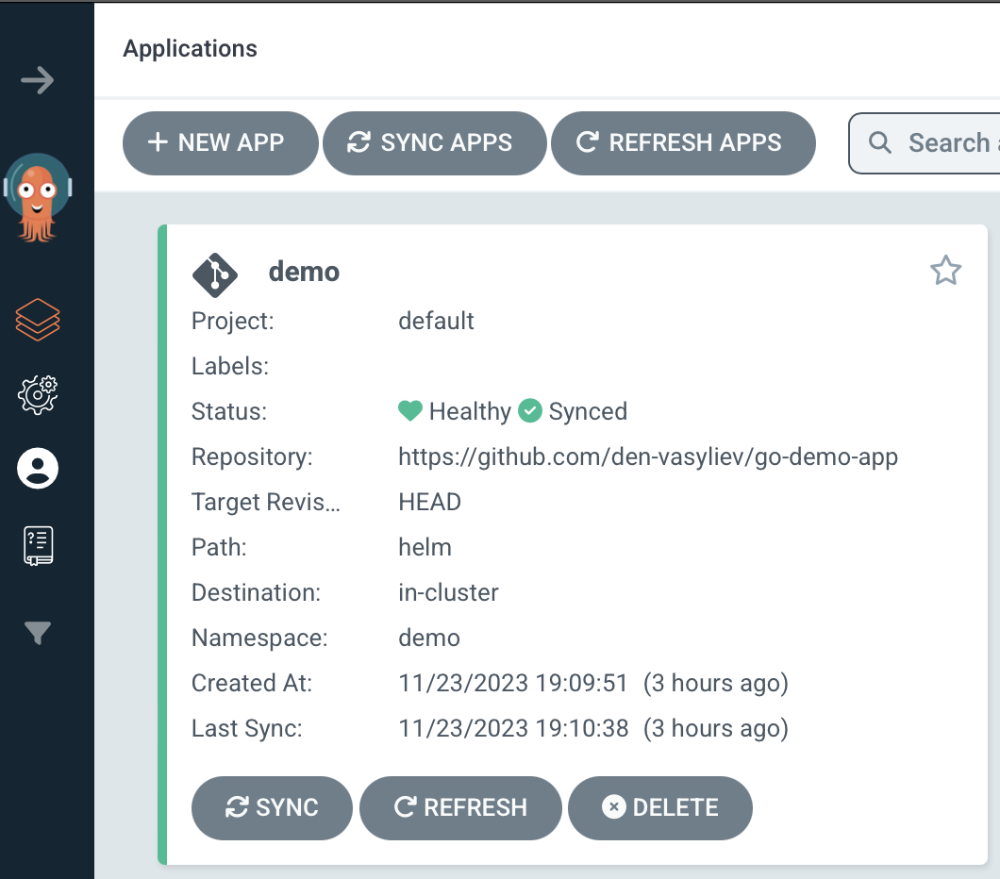

# Розгортання в ArgoCD

💡 Розгортання та отримання пароля адміністратора ArgoCD див [POC.md](POC.md).

## Створення розгортання застосунку

У вебінтерфейсі натисніть кнопку <kbd>+ NEW APP</kbd>.

Заповніть поля наступним чином:

### General

- Applicaton Name: назва вашого застосунку
- Project Name: default
- AUTO-CREATE NAMESPACE: ☑️

### Source

- Repository Url: https://github.com/den-vasyliev/go-demo-app
- Revision: HEAD
- Path: helm

### Destination

- Cluster URL: https://kubernetes.default.svc
- Namespace: demo

Або ж оберіть варіант <kbd>EDIT AS YAML</kbd> та вставте у вікно редагування коду наступне:

```yaml
apiVersion: argoproj.io/v1alpha1
kind: Application
metadata:
  name: demo
spec:
  destination:
    name: ''
    namespace: demo
    server: 'https://kubernetes.default.svc'
  source:
    path: helm
    repoURL: 'https://github.com/den-vasyliev/go-demo-app.git'
    targetRevision: HEAD
    helm:
      valueFiles: []
  sources: []
  project: default
  syncPolicy:
    syncOptions:
      - CreateNamespace=true
```

Перевірте, що в блоці **Helm** в розділі **PARAMETERS** підтягнулися параметри для сервісів (це може тривати певний час).

Натисніть <kbd>CREATE</kbd> в горі діалогу та дочекайтесь створення застосунку.

В результаті на головній маєте побачити наступне:



Натисніть на плашку застосунку, щоб переглянути його стан


Натисніть <kbd>🔄 SYNC</kbd> та дочекайтесь повного розгортання та синхронізації коду застосунку. Його стан має бути 💚 Health ✅ Synced – тепер він готовий до використання.

## Використання

[](https://asciinema.org/a/XZS3zzz099KZoyu3fwRg1fejU)

Відкрийте доступ до застосунку `ambassador`

```sh
k port-forward -n demo svc/ambassador 8088:80
Forwarding from 127.0.0.1:8088 -> 80
Forwarding from [::1]:8088 -> 80
^Z
[1]  + 21426 suspended  kubectl port-forward -n demo svc/ambassador 8088:80
```

Переведіть його у фоновий режи 

```sh
✦ bg %kubectl
[1]  + 21426 continued  kubectl port-forward -n demo svc/ambassador 8088:80
```

Перевірте, що є доступ до застосунку

```sh
✦ curl localhost:8088                                                  
Handling connection for 8088
k8sdiy-api:599e1af
```

Надішліть зображення

```sh
✦ curl -F 'image=@/tmp/img.png' localhost:8088/img/
```

У відповідь застосунок згенерує та покаже в терміналі його asciart-версію

```
00000000000000000000000000000000000000000000000000000000000000000000000000000000000000000000000000
00000000000000000000000000000000000000000000000000000000000000000000000000000000000000000000000000
GGGGGLffffffLfffffffffffffffffffLffLLLLLLLLLLLLCCCCCCCCCCCCCLLLLLLLLLLLLLLLLLLLLLLLLLLLLLLLGGGGGGG
00000fttttttttttttttttttttttttttttfffffffffLLf1i;::,,,,::;i1tffLfffffffffffffffffffffffffff0000000
00000fttttttttttttttttttttttttttfffffffLLf1;,..,:;iii1ii;:,.. ,;tLLfffffffffffffffffffffffLG000000
00000ftttttttttttttttttttttttttfffffLLti,,:;1fCGGGGGGGGGGGGCLti, ,1fLfffffffffffffffffffffL0000000
00000fttttttttttttttttttttttttffffLfi,.:tLGGGGCCCCCCCCCCCCCCGGGGLi..ifLfffffffffffffffffffL0000000
00000ftttttttttttttttttttttttfffffi..iLGGCCCCCCCCCCCCCCCCCCCCCCCGGC1..1LffffffffffffffffffL0000000
00000fttttttttttttttttttttttfffff, ;CGCCCCCCCCCCCCCCCCCCCCCCCCCCCCCGC; ;LfffffffffffffffffL0000000
00000ftttttttttttttttttttttfffff, ;CCCCCCCCCCCCCCCCCCCCCCCCCCCCCCCCCCG1 ;LffffffffffffffffL0000000
00000fttttttttttttttttttttffffL1  fCCCCCCCCCCCCCCCCCCCCCCCCCCCCCCCCCCCG; fffffffffffffffffL0000000
00000fttttttttttttttttttttffffL; ,LLCCCCCCCCCCCCCCCCCCCCCCCCCCCCCCCCCCGf 1LfffffffffffffffL0000000
00000ftttttttttttttttttttfffffL: ,CLCCCCCCCCCCCCCCCCCCCCCCCCCCCCCCCCCCGf iLfffffffffffffffL0000000
00000ftttttttttttttttttttfffffL: :CLCCCCCCCGGGGGGGGGGCCCCCCCGGGGGGGGCCG1 iLfffffffffffffffL0000000
00000fttttttttttttttttttffffffL: ;CLCCCCGGCti:,,..,ifCCCCCCC1;:::;1fCGCi 1LfffffffffffffffL0000000
00000fttttttttttttttttttffffffL: ;CLCCCCL;..:i1111i,.fGCCCGL.,;;;:,..iC; tffffffffffffffffL0000000
00000fttttttttttttttttttffLfttf, iCCCCGf:;tCLft111CGLLCCCCtCGfttffLCt.:; tLfffffffffffffffL0000000
00000fttttttttttttttttttft,;i;:. ;CCCCCCCGLi,  .tLCCCLLCCG:,Cii.  ,iCC:  tffffffffffffffffL0000000
00000fttttttttttttttttttL;:GGGGL.;GCCCCCCCCGCLLCGGCCCLLCCGf tGGLtfCCCCC;,i;,ffffffffffffffL0000000
00000fttttttttttttttttttL;;GCCCG;,GCCCCCCCCCCGGCCCCCCLLCCCC.,GCGGGCCCCG1;GL iLffffffffffffL0000000
00000fttttttttttttttttttft.CGCCG1.CCCCCCCCCCCCCCCCCCLLLLCCGi LGCCCCCCCGt,Gf tLffffffffffffL0000000
00000fttttttttttttttttttfL,:CGCGt LCCCCCCCCCCCCCCCCCLLLCGCGL 1GCCCCCCCGf,Gi.ffffffffffffffL0000000
00000fttttttttttttttttttfLt .fGGf tCCCCCCCCCCCCCCLLf1tfLLLL1 :GCCCCCCCGL,L.;LfffffffffffffL0000000
00000fttttttttttttttttttffft: ;ff iCCCCCCCCCCCCLLLL;. ..... .1CCCCCCCCCC..,fffffffffffffffL0000000
00000ftttttttttttttttttttfffLt:.. ;CLCCCCCCCCCGGGGGGGCCCCCCCGGGGGCCCCCGL :ffffffffffffffffL0000000
00000ftttttttttttttttttttffffLLf1 ,CLLCCCCCCCCttft111ttttttt11ttLCCCCCGi,LffffffffffffffffL0000000
00000fttttttttttttttttttttffffffL: fCLLCCCCCCC;  ;fLLfffffffLf. tGCCCGL.ffffffffffffffffffL0000000
00000fttttttttttttttttttttffffffft :CLLLLCCCCCGf:.;LG008800GL: iCCCCCG:;LfffffffffffffffffL0000000
00000ftttttttttttttttttttttffffffL: tCLLLLCCCCCGGL1:,,,,,,,,:iLGCCCCCt tffffffffffffffffffL0000000
00000fttttttttttttttttttttttfffffL;  1CCLLLLCCCCCGGGGGGGGGGGGGGCCCCCC,,LffffffffffffffffffL0000000
00000fttttttttttttttttttttttfffffL:   :fCCLLLLCCCCCCCCCCCCCCCCCCCLLC; tfffffffffffffffffffL0000000
00000ftttttttttttttttttttttttffffL: .f:.;fCCLLLLCCCLLLLLLLLLLLLLLCC; 1LfffffffffffffffffffL0000000
00000fttttttttttttttttttttttttfffL: .LCf:.:tLCCLLLLLLLLLLLLLLLLCCf,.tLffffffffffffffffffffL0000000
00000ftttttttttttttttttttttttttffL: .fLLCf;..;tLCCCCCCCCCCCCCCLt:.;fLfffffffffffffffffffffL0000000
00000fttttttttttttttttttttttffffLL: .fLLLLCL1:..,;i1ttffttti;:, :fLfffffffffffffffffffffffL0000000
00000ftttttttttttttttfffftt1i;:,,.  .LLCCCCCCC1 i;:::::::  ;:   1LLLLfffffffffffffffffffffL0000000
00000ftttttttttttttft1;:,.....,:;;  .fCCCCCCCCL;CCGGGGCCL :Gf    .:i1tfLLfffffffffffffffffL0000000
00000fttttttttttttt;.  ,;1tfLLLLLC1. .tGGCCCCCCCCCCCCCCG;,LGt  .1;:,. .:1fLfffffffffffffffL0000000
00000ftttttttttttt,  ;fLLCLLLLLLLfLf;  ,1LGGGGGGGGGCCCC1;CGG,   tCLLLti, .1LffffffffffffffL0000000
00000fttttttttttf;  :LLf,;LLLLLLLLLLLf1: .,;i1111tLGCCLfGGC;     tLfLCLL1  tffffffffffffffL0000000
00000fttttttttttt.  tLfLf ;LLLLLLLLLLLLLLti;:,,,,  iGCCGG1   ,,,:fLLtifLC; :LfffffffffffffL0000000
00000ftttttttttfi  ,LLLfLi :LLLLLLLLLLLLLLLLLLLLLfi iGGf, :1fLLLLLL1 ,fLLt  ffffffffffffffL0000000
00000ftttttttttf:  iLLLLLf. 1LLLLLLLLLLLLLLLLLLLLLCt t;.ifLLLLLLLLL.,LLLLf  1LffffffffffffLG000000
00000ftttttttttf,  tLfLLfL: :LfLLLLLLLLLLLLLLLLLLLfL: :fLLffLLLLLLf :LfLLf  iLffffffffffffL0000000
GGGGGfffffffffff;,,LLLLLLL1,;LLLLLLLLLLLLLLLLLLLLLLL1,LLLLLLLLLLLLf,:LLLLf,,1LfLLLLLLLLLLfLGGGGGGG
GGGGGGGGGGGGGGGG000GGGGGGG00GGGGGGGGGGGGGGGGGGGGGGGG00GGGGGGGGGGGGG0GGGGGG00GGGGGGGGGGGGGGGGGGGGGG
00000000000000000000000000000000000000000000000000000000000000000000000000000000000000000000000000
00000000000000000000000000000000000000000000000000000000000000000000000000000000000000000000000000
```